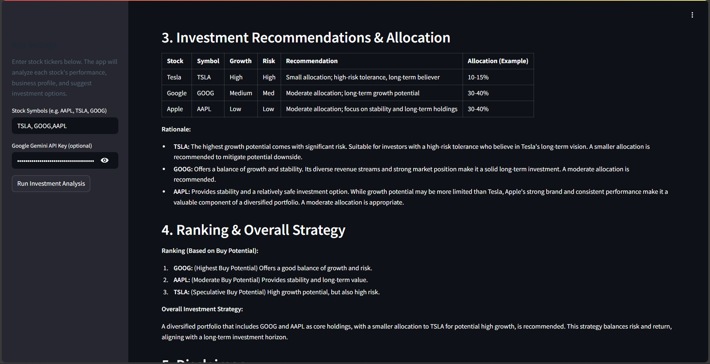

# 📊 Agentic AI Stock Advisor

An AI-powered stock insights app that pulls **real-time market data** from Yahoo Finance, analyzes **6-month performance**, summarizes **company profiles & news**, and compiles **actionable investment picks** using **Gemini** with an **agentic workflow**—all in a clean **Streamlit** UI.&#x20;

## ✨ Features

* **Market Performance Analysis:** Computes 6-month percent change for user-entered tickers and ranks them.
* **Company Intelligence:** Auto-summaries of sector, market cap, business description, and latest news.
* **Agentic Recommendations:** Multiple Gemini-backed agents (market, company, strategy, compiler) generate a consolidated investor report.
* **Interactive Charts:** Plotly line chart of 6-month closing prices for all selected tickers.
* **Simple UI:** Streamlit sidebar for tickers and API key, with a single **Run Investment Analysis** action.

## 🧠 How It Works (Agents & Flow)

1. **Data Fetch (yfinance):**

   * Downloads 6-month price history per symbol; computes sum of daily percent changes as the performance signal.
2. **Market Insight Agent (Gemini):**

   * Interprets performance dict and ranks symbols.
3. **Company Insight Agent (Gemini):**

   * Uses per-symbol **profile (name, sector, market cap, summary)** + **top news** to produce investor-friendly briefs.
4. **Strategy Agent (Gemini):**

   * Weighs growth, risk, trends to suggest stock picks.
5. **Insight Compiler (Gemini):**

   * Merges market view + company briefs + picks into a cohesive investor report.
6. **Visualization (Plotly):**

   * Renders 6-month historical price chart for quick comparison.

## 🏗️ Tech Stack

* **Frontend/App:** Streamlit
* **Data & Viz:** yfinance, Plotly
* **LLM & Agents:** Gemini (via `agno`), multi-agent prompts
* **Config:** python-dotenv

## 📁 Project Structure

```
.
├─ app.py                # Streamlit app, agent definitions & UI
├─ .env                  # GOOGLE_API_KEY (not committed)
└─ requirements.txt      # see below
```

### Suggested `requirements.txt`

```txt
streamlit
yfinance
plotly
agno
python-dotenv
```

## 🔧 Setup & Run

1. **Clone & Install**

   ```bash
   git clone <your-repo-url>
   cd <your-repo>
   pip install -r requirements.txt
   ```

2. **Environment**

   * Create a `.env` file in the project root:

     ```env
     GOOGLE_API_KEY=your_gemini_api_key
     ```
   * You can also paste the key in the app’s sidebar field at runtime.

3. **Start the App**

   ```bash
   streamlit run app.py
   ```

## 🖱️ Usage

1. Open the Streamlit app in your browser (auto-opens or visit the shown localhost URL).
2. In the **sidebar**:

   * Enter **tickers** (e.g., `AAPL, TSLA, GOOG`).
   * Provide **Gemini API key**.
   * Click **Run Investment Analysis**.
3. Read the **Investment Summary** (market overview, company insights, ranked picks) and explore the **6-month chart**.

## 📌 Notes & Assumptions

* **Performance Metric:** Sum of daily percent changes over the last 6 months (simple heuristic for momentum).
* **News & Profiles:** Pulled via `yfinance`’s `Ticker().info` and `Ticker().news` (top 5).
* **Models:** Uses **`gemini-2.0-flash-exp`** (as configured in the code).
* **Not Financial Advice:** This app is for educational/demonstration purposes only.

## 🧪 Extending the App (Roadmap Ideas)

* Add **risk metrics** (volatility, drawdown), **technical indicators** (RSI, MACD), and **fundamentals** (PE, EPS growth).
* Introduce **portfolio simulation** (equal-weight vs. risk-parity) and **backtesting**.
* Switch to **vector-retrieved news** (RAG) for deeper context and de-duplication.
* Add **caching** for API calls and a **job queue** for batch analysis.
* Support **watchlists** and **alerting** (price thresholds, news triggers).

## 🛠️ Troubleshooting

* **“Google API Key is missing”** in the UI:
  Ensure `.env` has `GOOGLE_API_KEY` or paste the key in the sidebar field.
* **No data for a symbol:**
  Some tickers may lack 6-month data or be illiquid; try different symbols.
* **Rate limits / slow responses:**
  Heavy use or many symbols may cause latency; reduce tickers or add caching.


---





